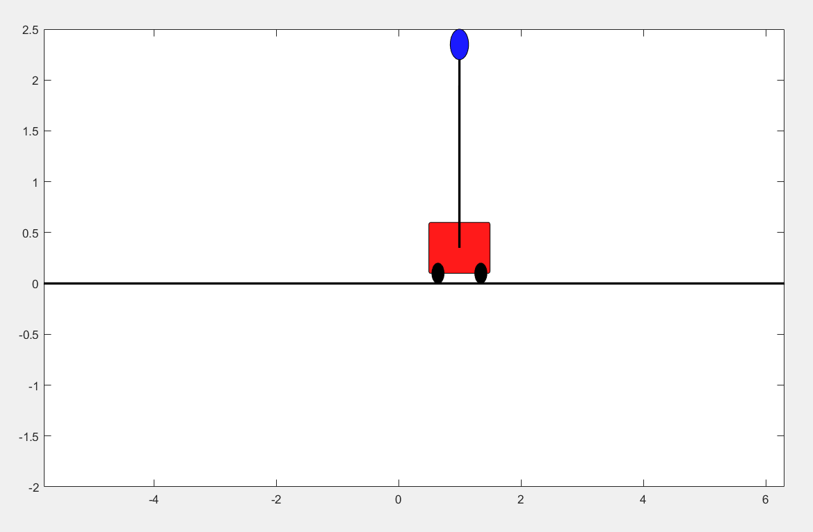
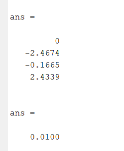

  <h1 align="center">LINEAR QUADRATIC REGULATOR CONTROL FOR INVERTED PENDULUM ON A CART</h1>

  

* Cart Simulation and Balancing of Pendulum

  

* eig A tells us if the system is controllable or not
